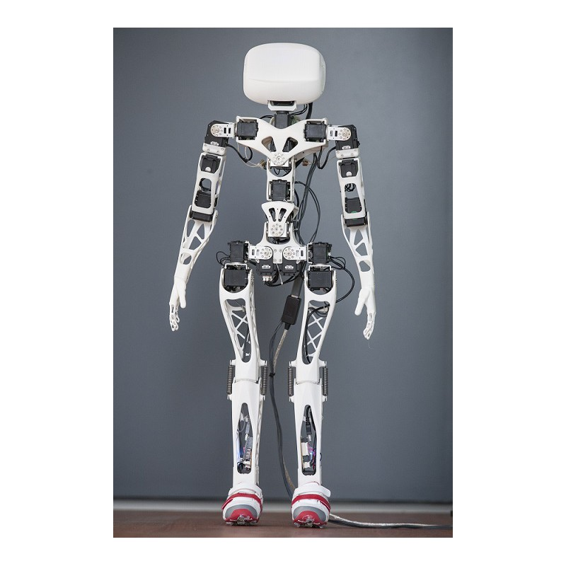
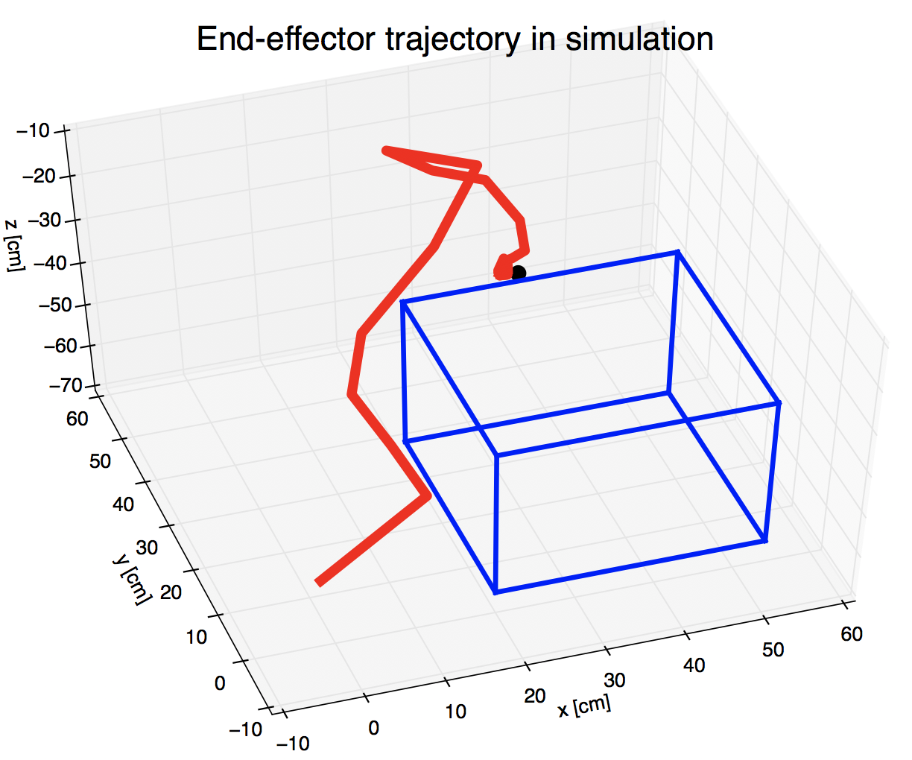

 Reaching Movement Learning with Deep Reinforcement Learning
==============================================

<p align='center'>    
	
<p/>

## Introduction 
This project focuses on controlling Poppy Humanoid to reach a target on the table with Deep Reinforcement Learning. The target could appear at every possible point on the table. The implementation of this project mainly contains two parts: environment and algorithm. Environment, which can be modeled as Markov Decision Process, is implemented from scratch without using additional reinforcement learning libraries. 
 
<p align='center'>    
	
<p/>

[Project]() | [Video](https://youtu.be/oOG4bsWDT0M)

## Robot arm end-effector trajectory
- Our robot end effector motion planning results
<p align='center'>    

Here, right line indicates robot arm end-effector, blue box indicates table, black point is the given target point.


## Dependencies
* Python 2.7
* tensorflow 1.4.0
* matplotlib 1.5.1
* tensorflow 1.4.0
* pypot 2.11.0rc5
* vrep simulator 3.5

## Installation
* Open terminal, type 

```
pip install tensorflow-gpu==1.4.0
pip install pypot
```
* For simulation env Vrep, installation method can be found at [Vrep official website](http://www.coppeliarobotics.com/downloads.html).

## Usage
```
 git clone https://github.com/JiaojiaoYe1994/robot_motion_learning_with_reinforcement_learning.git
 cd ./robot_motion_learning_with_reinforcement_learning/
```

### 1. Training

* To train a model , type `python train.py` in terminal, and try `python train.py -h` for possible input arguments. 

For example, 
```
python train.py --max_episodes 1500 --lr_actor 1e-3
```
* By default, checkpoints will be saved under `./checkpoints/DDPG.ckpt` .

### 2. Testing
Test the model: 
```
python eval.py
```


## License Information
MIT
